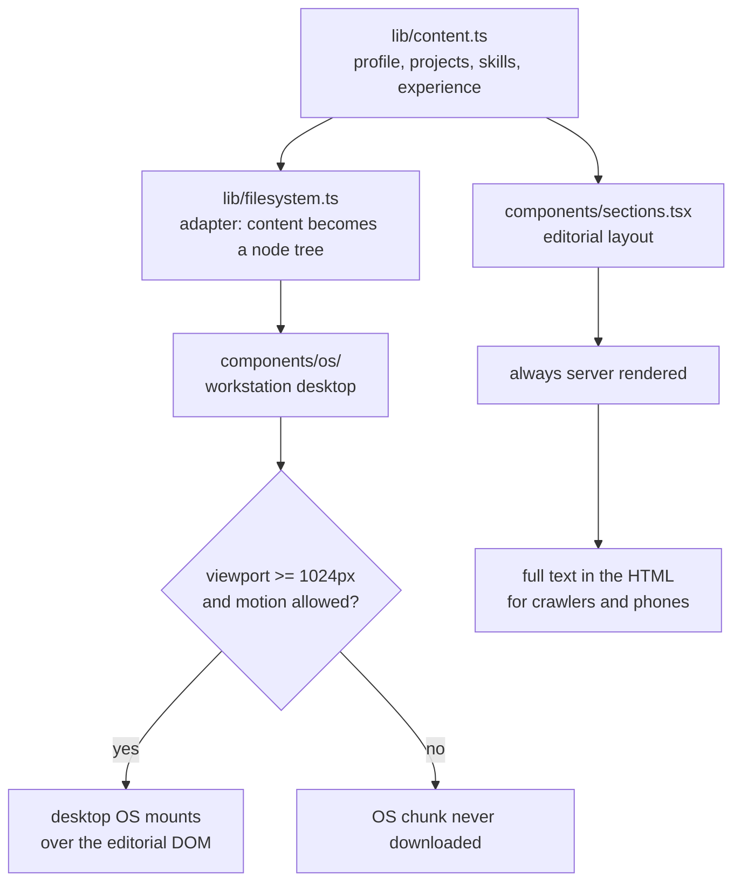
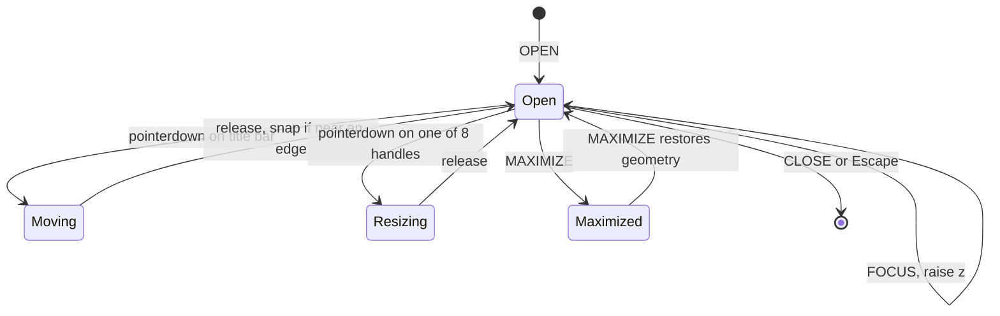

# Portfolio

A personal portfolio built as a **custom desktop operating system**. A CRT monitor boots, dissolves into a full-screen desktop, and the site becomes a windowed three-pane file browser: a tree on the left, content in the middle, and a Finder-style properties inspector on the right.

Phones, search crawlers, and anyone who prefers reduced motion get a conventional editorial site instead. Both are rendered from one content file.

**Stack:** Next.js 16 (App Router, Turbopack) · React 19 · TypeScript · Tailwind CSS v4 · Framer Motion

---

## Why an OS

Two problems with a conventional portfolio layout drove this:

1. **One slot per project.** There was nowhere to put screenshots, demos, sub-links, or per-project depth. Projects with less written about them looked broken rather than simply smaller.
2. **It read as templated.** Numbered section markers and a dark palette with one bright accent are the default look of an AI-generated site.

A file tree fixes both. It is genuinely how an engineer organises work, so the structure encodes something true instead of decorating, and it holds arbitrary depth per project. A folder with fewer files reads as normal, not as an error.

---

## Architecture

`lib/content.ts` is the single source of truth. Nothing else owns content. Two independent presentation layers read from it.



### The two views

| | Desktop OS | Editorial |
|---|---|---|
| Who gets it | >= 1024px, motion allowed | Phones, reduced motion, no JS, crawlers |
| Rendering | Client only, `dynamic(ssr: false)` | Server rendered, always in the HTML |
| Purpose | The experience | The document |

The editorial markup is **always** in the server response. The OS mounts on top of it as a fixed overlay. If the OS replaced the page, everything a crawler indexes would sit behind double clicks.

Two independent gates keep this correct:

- **CSS** hides the editorial view at `>= 1024px and (prefers-reduced-motion: no-preference)`, which prevents a flash before hydration.
- **JS** mounts the OS only when the same conditions hold, which keeps the window manager, boot sequence, and browser off phones entirely.

A tiny inline script in `app/layout.tsx` stamps `data-os` on `<html>` before first paint. With JavaScript disabled the attribute never appears and the editorial view simply stays.

---

## The filesystem adapter

`lib/filesystem.ts` maps content onto a browsable tree. It does not restructure `content.ts`, which still feeds the editorial view.

```
~
├── know-me          profile, highlights, current roles, awards
├── projects/
│   └── clusterpath/ readme.md · live.link · code.link · screenshots/
├── skills/          one file per skill group
├── experience/      one file per position, plus awards
├── resume.pdf
└── contact.txt
```

Each node carries a `view` discriminator that the content pane switches on, and a `meta` object the properties pane renders. Adding a project to `content.ts` makes it appear in the tree, the desktop, and the editorial list with no other change.

`assertTreeIntegrity()` runs on import in development and throws if any path is duplicated, any project is missing from the tree, or any link resolves to an empty href. No test framework involved.

---

## Window manager

`components/os/wm/` is a hand written window manager. State lives in one reducer; geometry is committed on pointer release so dragging re-renders a single window rather than the whole desktop.



Drag, the eight resize handles, and the pane dividers all share one `usePointerGesture` hook. Framer Motion's `drag` was deliberately not used: drag, resize, snap, and maximize all mutate the same `{x, y, w, h}`, and reconciling a library that owns its own drag transform costs more code than the shared hook. Framer Motion still drives window open and close animation.

`assertWm()` covers open deduplication, z-raising, maximize and restore, clamping, edge snapping, and close.

---

## Design language

Deliberately split down the middle, with one rule: **the desk is modern, the machine on it is vintage.**

| Vintage | Modern |
|---|---|
| Window chrome, chunky bevels | Ambient drifting wallpaper |
| Hatched title bars | Frosted glass taskbar |
| Phosphor readouts `#7ce0b0` | Depth, blur, soft rounding |
| Amber accent `#e08a2e` | Light and dark colour modes |

Two colour modes, switchable from the taskbar. **Light** is warm cream: a
`#f8f4ea` content pane in tan chrome under an olive-brown title bar. **Dark**
is the industrial original: warm grey chassis on teal-slate. Amber is the
accent in both; the chrome is what changes.

Four chrome skins ship alongside: Workstation, Aqua, Redmond and Gnome. They
reference each OS family through layout and treatment rather than cloning it.

Phosphor green is kept scarce on purpose. It appears only where the machine reports a real value: instrument readouts, the taskbar clock, and the boot sequence. That scarcity is what makes it read as instrumentation rather than decoration.

### Live wallpaper

The desktop background is a canvas **aggregation field**: client nodes drift, and in slow rounds their edges to a wandering centroid brighten in an outward ripple. It is secure aggregation, the subject of the federated learning research listed in the site itself, rendered as ambient wallpaper.

Long slow edges were chosen over fine detail deliberately. The taskbar blurs at 22px, which annihilates anything finer, so large forms are the only thing that actually refracts through the glass.

---

## Performance

The OS is measured, not estimated.

| | |
|---|---|
| Wallpaper draw cost | ~0.5% of one core |
| Mobile JS chunks | 11 |
| Desktop JS chunks | 12, the extra one being the entire OS |

Guards: device pixel ratio capped at 1.5, 30fps throttle, work skipped when the tab is hidden, and the field pauses entirely when a maximized window covers it.

`three`, `@react-three/fiber`, and `gsap` are dependencies of the editorial showstopper only. They are not on the OS path, so the desktop experience does not pay for them.

---

## Accessibility

- Reduced motion skips the OS entirely rather than dampening it.
- The full site content is in the server HTML regardless of which view renders.
- The file tree is keyboard navigable, `Escape` closes the focused window, and pane dividers respond to arrow keys.
- Focus rings are amber inside the OS and violet in the editorial view, each against its own surface.
- The boot sequence is skippable and runs once per session.

---

## Running it

```bash
pnpm install
pnpm dev      # http://localhost:3000
pnpm build    # production build
```

Worth checking when changing either view:

- **1440px** for the OS, **380px** for the editorial fallback
- Reduced motion enabled at desktop width should render the editorial view
- View source at desktop width should still contain the full editorial text
- `?path=/projects/suga` should open that node directly

---

## Adding content

Everything flows from `lib/content.ts`.

- **A project**: append to `projects`. It appears in the tree, on the desktop, and in the editorial list automatically. `featured: true` also gives it the editorial showstopper.
- **Screenshots**: add an entry to the `SCREENSHOTS` map in `lib/filesystem.ts`. The `screenshots/` folder only appears for projects that have them, so no empty folders ship.
- **A résumé**: replace `public/Sandesh_Bhattarai_Resume.pdf`. The viewer uses the browser's native PDF rendering, so there is no viewer library to configure.
